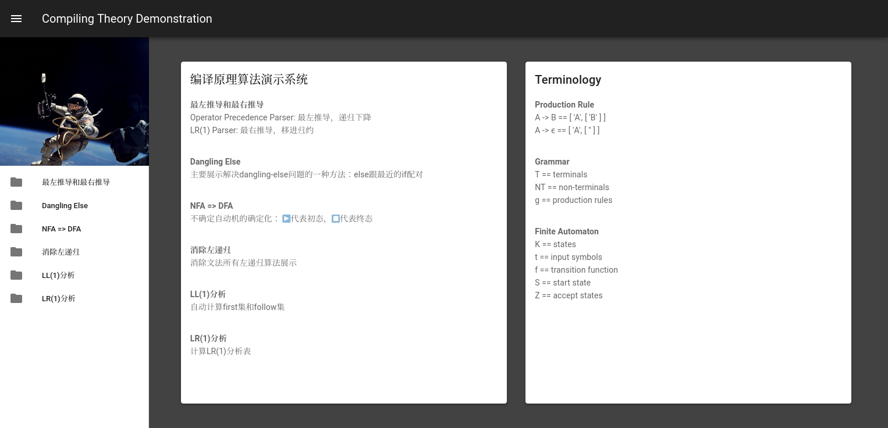

# Compiling Theory Demonstration

This project demonstrates some algorithms of compiling theory 

Currently, it contains: 

- A operator-precedence parser and a lr1 parser
- A way to resolve the dangling else problem
- NFA to DFA conversion
- Left recursion elimination 
- The first set and follow set computation of ll1 parsing
- A parsing table generator of lr1 parsing

For more information, you can check the website!

PS: prs and issues are welcomed 😎! 

